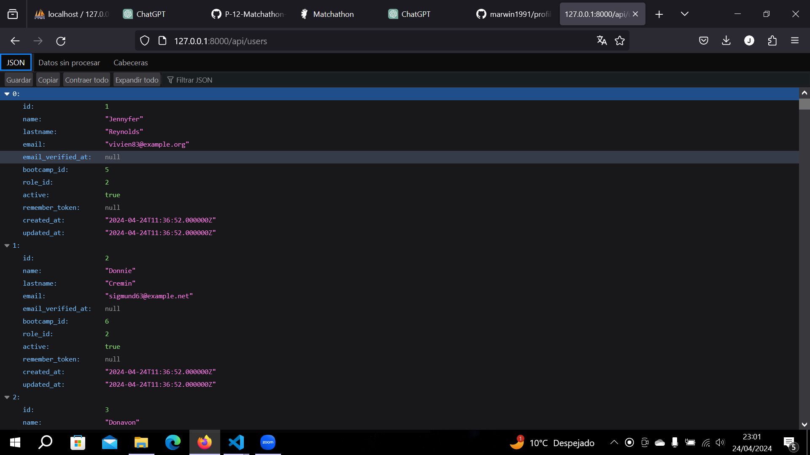

# MATCHATHON

 Matchathon, una aplicación semiautomatizada, diseñada para simplificar el proceso de formación de equipos en eventos como la Hackathon F5. Matchathon transforma la manera en que creamos equipos equitativos para alcanzar el éxito en estos desafiantes eventos, garantizando la diversidad de conocimientos y simulando un entorno de trabajo real.



## Descripción

Este repositorio alberga la Api dedicada, diseñada con un modelo MVC en Laravel. La aplicación se integra con un frontend desarrollado en React, que proporciona las vistas a través de un diseño Atomic design, La API se integró con un frontend desarrollado en React, que proporciona la interfaz de usuario para que los usuarios interactúen con la plataforma [Matchathon](https://github.com/LiwKltn/P-12-Matchathon-Front-end).

## Diseño de la Base de Datos
 Se diseñó la estructura de la base de datos para almacenar la información necesaria, incluyendo tablas para usuarios, equipos, tecnologías, niveles, entre otros. Se definieron las relaciones entre estas entidades para garantizar la integridad de los datos.

## Instalación

Para instalar este repositorio debes seguir los siguientes pasos: 

```bash
git clone https://github.com/LiwKltn/P-12-Matchathon-Front-end.git

composer install

php artisan serve
```

## Uso

Ingresa las rutas de la Api:
```
http://127.0.0.1:8000/api/users
http://127.0.0.1:8000/api/teams
http://127.0.0.1:8000/api/user-backendtech-levels
http://127.0.0.1:8000/api/levels
http://127.0.0.1:8000/api/controlversions
http://127.0.0.1:8000/api/frontendtechnologies
http://127.0.0.1:8000/api/backendtechnologies
http://127.0.0.1:8000/api/bootcamps

```

## Creadoras: 
[Maria Mendez](https://github.com/mariamf1985)
<br>
[Loli Vila](https://github.com/Vila71)
<br>
[Oliwia Koltun](https://github.com/LiwKltn)
<br>
[Marta Parra](https://github.com/Macata47)
<br>
[Johana Sandoval](https://github.com/Sandovaljohana)

